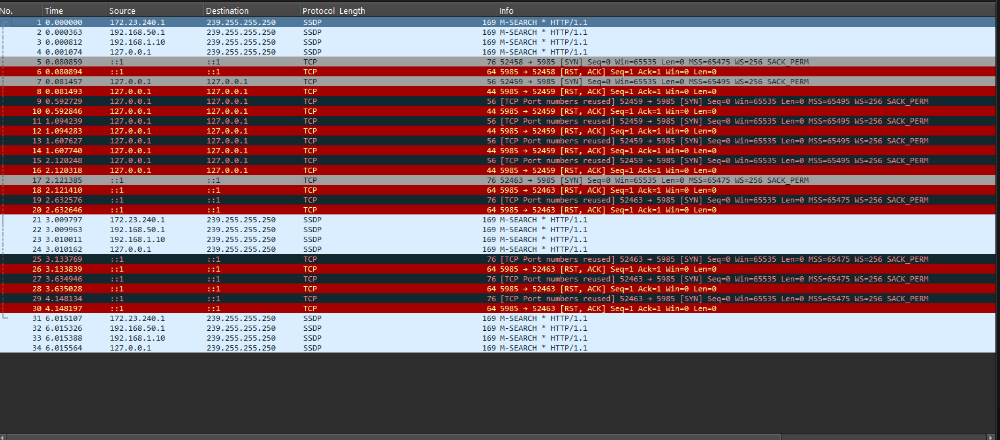
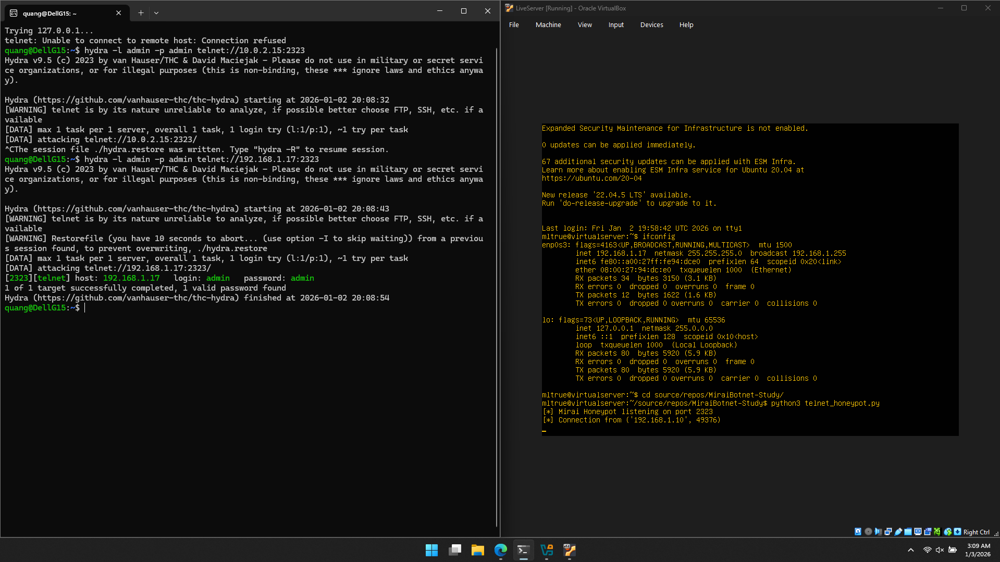

# Mirai Botnet

## Definition

Mirai is malware that infects smart devices that run on ARC processors, turning them into a network of remotely controlled bots or "zombies". This network of bots, called a botnet, is often used to launch DDoS attacks.

## How does Mirai works

Mirai scans the Internet for IoT devices that run on the ARC processor. This processor runs a stripped-down version of the Linux operating system. If the default username-and-password combo is not changed, Mirai is able to log into the device and infect it.

IoT, short for Internet of Things, is just a fancy term for smart devices that can connect to the Internet. These devices can be baby monitors, vehicles, network routers, agricultural devices, medical devices, environmental monitoring devices, home appliances, DVRs, CC cameras, headset, or smoke detectors.

## How does malware turn IoT devices into bots or zombies?

In general, email phishing is a demonstrably effective way of infecting the computer - the victim is tricked into either clicking a link that points to a malicious website, or downloading infected attachment. Many times the malicious code is written in such a way that common antivirus software is not able to detect it.

In the case of Mirai, the user doesn’t need to do much beyond leaving the default username and password on a newly installed device unchanged.

## Visualization

In this project, I developed a Python-based virtual machine designed to emulate IoT devices that use weak authentication credentials. The implementation, provided in `telnet_honeypot.py`, functions as a honeypot, allowing adversaries to interact with it as though it were a vulnerable real-world device.

Using a single command such as

`hydra -l admin -p admin telnet://[TELNET_IP]:2323`

(e.g., targeting localhost) an attacker can successfully authenticate to the device. This demonstrates how easily insecure IoT systems can be compromised when default or weak credentials are used.

## Wireshark Capture

❗ 2️⃣ Repeated TCP SYN + RST on Loopback (Important Part)

You have many packets like:

127.0.0.1 → 127.0.0.1
5985 → 52459  [SYN]
then
52459 → 5985 [RST, ACK]

Also IPv6 loopback:

::1 <-> ::1

What it means

Your local machine is trying to open a TCP connection to itself

The target port immediately responds with RST

Wireshark says: TCP Port numbers reused → meaning repeated failed reconnect attempts

Key Port to Notice

Port 5985
That is Windows Remote Management (WinRM HTTP service).

So something on your PC keeps trying to open a WinRM session to itself, but:

either WinRM is not running

or the connection is blocked

or something is misconfigured

## With real LAB

